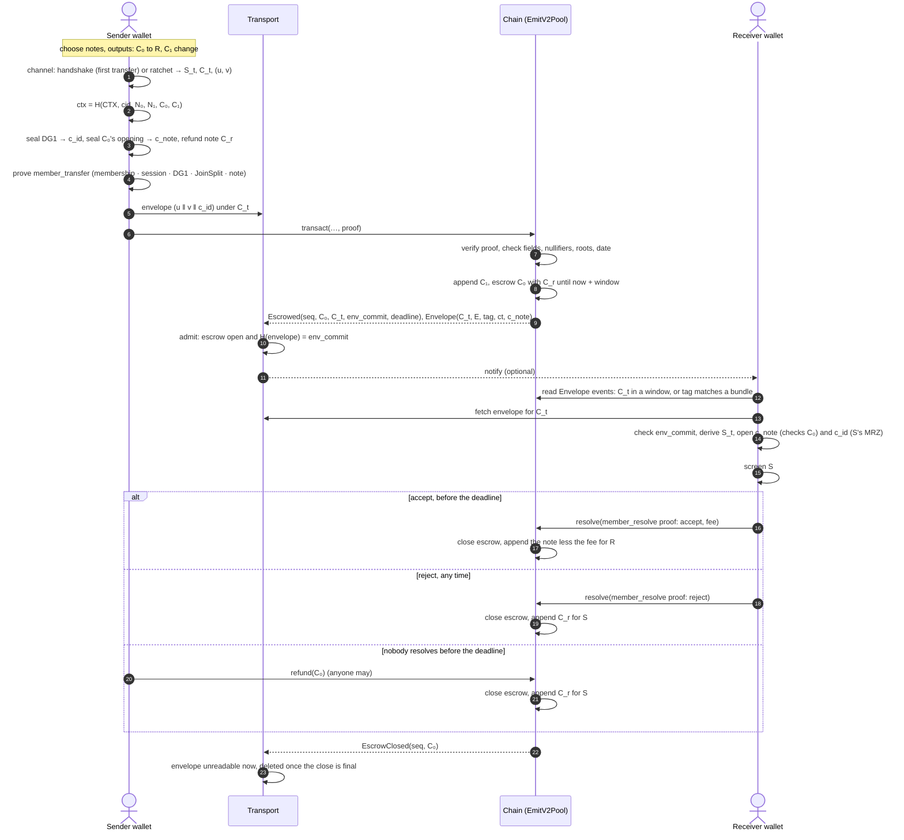

# The Emit V2 transfer protocol

This document specifies what happens in an Emit V2 private transfer, end to end: who does what, in
which order, what each step carries and binds, what the chain enforces, and what the off-chain
transport (which this repository does not implement) must and should do. It states the contract
around the code here. For details it points at the circuits (`noir/`), the contract
(`contracts/`), the crates (`rust/`) and the channel's own specification,
[zk-encryption's PROTOCOL.md](https://github.com/zk-experiments/zk-encryption/blob/main/PROTOCOL.md).

## 1. Roles and layers

| Role | Who | Does |
|---|---|---|
| **Holder** | a passport holder with a wallet | registers once, then sends and receives transfers |
| **Sender (S)** | the paying holder | proves the transfer, seals the payloads, hands the envelope to the transport |
| **Receiver (R)** | the paid holder | publishes a key bundle, recognises its transfers, opens them, screens the sender, resolves |
| **Chain (V)** | `EmitV2Pool` with the `ZK_VERIFY` precompile | verifies every proof, holds the note tree, the identity tree and the escrows |
| **Transport (T)** | e.g. envelope-inbox, or emit-devnet's shared directory | carries the off-chain envelope from S to R |
| **Observer (O)** | anyone watching the chain or the network, now or later | must learn nothing beyond what §8 lists |

The protocol has three layers, and this repository holds the first and the third:

- **What is carried** (`emit-protocol` crate): the data a transfer carries between S and R, and
  the commitments that bind it. Pure: types, encodings, commitments and note math, no I/O.
- **Delivery** (not here): getting the off-chain envelope from S to R. §9 states what any
  transport must and should do.
- **Enforcement** (`contracts/`, bound by `emit-protocol-abi`; the prover side is
  `emit-circuits`): the chain verifies each transfer against the rules and that delivery happened.
  It never carries the envelope.

## 2. Building blocks

- **Identity** (eid-circuits). A passport's DSC, SOD and document steps prove that DG1 (the MRZ)
  is signed under a CSCA in the accepted registry. They run once per registration; every later
  transaction proves membership in the pool's identity tree instead.
- **Channel** (zk-encryption). A post-quantum channel from S to R: a handshake (classical Grumpkin
  DH plus an ML-KEM-768 lattice encryption, bound into one root `S₀`), then a symmetric ratchet
  `S_{t+1} = H(RATCHET, S_t)`. Each transfer publishes `C_t = H(COMMIT, S_t)` and seals payloads
  under `H(KEY, S_t, ctx, domain)`. The receiver recognises a handshake by its tag and a ratchet
  transfer by `C_t` in its window.
- **Notes** (the emit layer). A shielded note is `C = H(COMMITMENT, cid, pk, value, rho, r)`, with
  `pk = H(PK, sk)`. Spending it publishes `N = H(NULLIFIER, H(NK, sk), rho)`. A transfer is a
  2-in / 2-out JoinSplit, and every output is 0 or at least `MIN_NOTE_VALUE` (1/3 of the coin).
- **Folding** (noir-zk). Each transaction is one Chonk proof, folding a pipeline of apps under
  generic kernels. Apps are linked by commitments (`PayloadCommitment`) and bound to earlier
  apps' public slots (`ctx`, `C_t`, `holder_tag`).

Every hash is Poseidon2 over BN254, with its domain the ASCII tag as a big-endian integer
(`"emit-v2/<label>"`, `"pq-ratchet/<label>/v1"`, …).

## 3. What a transfer carries

| Value | Where | Binds | Defined in |
|---|---|---|---|
| `N₀, N₁` | calldata, proof | the spent notes (unlinkable to their commitments) | emit layer |
| `C₁` (output 1, usually change) | calldata, proof; appended at once | the sender's or anyone's note | emit layer |
| `C₀` (output 0, the payment) | calldata, proof; **escrowed** | R's note | emit layer |
| `C_r` (refund note) | proof | output 0's value for S's key, `rho = H(RHO, N₀, 2)` | `transfer_holder` |
| `ctx = H(CTX, cid, N₀, N₁, C₀, C₁)` | proof, recomputed by V | the transfer every payload is bound to | emit layer |
| `C_t, E, tag, ct_commitment` | proof, `Envelope` event | the channel session (R recognises it) | zk-encryption |
| `c_note` (6 fields) | proof, `Envelope` event | C₀'s opening, sealed under `KEY_NOTE` | zk-encryption |
| `cid_commit = H("emit-v2/dg1-envelope", c_id)` | proof | the sealed DG1, whose ciphertext is **not** on-chain | `dg1_envelope` |
| `env_commit = H("emit-v2/envelope", ct_commitment, cid_commit)` | `Escrowed` event | the whole off-chain envelope | V computes it |
| **Envelope** `u ‖ v ‖ c_id` (1,728 B) | **off-chain only** | the lattice ciphertext (1,536 B) and the sealed DG1 (6 × 32 B) | `emit_protocol::Envelope` |

The envelope is the only thing the transport carries, and `env_commit` is the only thing it is
checked against. It holds no plaintext: `u ‖ v` is an ML-KEM-style ciphertext, and `c_id` is DG1
under a key only S and R can derive.

## 4. Setup (once per holder)

1. **Keys.** The wallet draws the spending key `sk` (address `pk = H(PK, sk)`) and the receiver's
   keys (a Grumpkin key and an ML-KEM-768 key pair).
2. **Bundle.** It publishes a signed key bundle: chain id, `pk`, the Grumpkin key, the ML-KEM
   encapsulation key and its commitment, and a validity window. A transport may add how to reach
   R (§9.2). Senders accept a bundle after checking its format, chain id, window, curve point and
   key commitment.
3. **Registration.** The holder proves `identity_register`: eid's DSC, SOD and document steps,
   then `register`, which publishes the blinded leaf
   `L = H("emit-v2/identity/v2", pk, H(DG1 payload), expiry, r)`. The document's nullifier is
   scoped to the pool and the epoch (7 days), so a passport has one live registration per epoch
   (two in an epoch's last day). The pool appends `L` to the identity tree. The blinding `r` keeps
   the registration unfindable by anyone who knows `pk` and the MRZ.

## 5. The transfer, step by step

### 5.1 Sender

1. **Choose.** One or two input notes (or dummies of its own key), the payment `v₀` to R's `pk`,
   change to itself, a fee. Every output is 0 or at least `MIN_NOTE_VALUE`.
2. **Channel.** The first transfer to R is the handshake: `E = e·G`, `Z = e·V_R`, the lattice
   ciphertext `(u, v)` of `m` under R's ML-KEM key, `tag = H(TAG, Z, pq_commit)`, and
   `S₀ = H(ROOT, m, Z, E, ct_commitment, pq_commit)`. Later transfers advance the ratchet and fill
   the handshake fields with a throwaway key, so every transfer has one shape. The wallet persists
   the advanced state **before** broadcasting: a reused chain index links two transfers.
3. **Bind.** `ctx = H(CTX, cid, N₀, N₁, C₀, C₁)`: unique per transfer, since `N₀` is spent once.
4. **Seal.** DG1 under `KEY_PAYLOAD` gives `c_id`; C₀'s opening `(value, rho, r)` under `KEY_NOTE`
   gives `c_note`. Both are keyed by `S_t` and bound to `ctx`.
5. **Refund.** `C_r = H(COMMITMENT, cid, H(PK, sk_S), v₀, H(RHO, N₀, 2), r_r)`, with `r_r` kept
   by S: what S gets back if C₀ is never accepted.
6. **Prove** `member_transfer`, five apps folded into one proof:
   - **membership:** S's leaf under a known identity root at today's date, a fresh DG1
     commitment, and the holder tag `H(HOLDER, sk, ctx)`;
   - **session:** the KEM and `C_t`, publishing `ctx`;
   - **DG1 envelope:** DG1 sealed, only `cid_commit` public;
   - **transfer:** the JoinSplit, bound to `ctx` and to the holder tag, publishing `C_r`;
   - **note envelope:** C₀'s opening sealed.
7. **Deliver**, then **send.** S hands the envelope `u ‖ v ‖ c_id` to the transport under `C_t`
   (§9), then sends `transact`. A transport that admits only against a confirmed escrow is retried
   after the transaction confirms (§9.1).

### 5.2 Chain

On `transact`, `EmitV2Pool` does the following:

1. **Proof:** calls `ZK_VERIFY(member_transfer root ‖ proof)`. The proof must verify under the
   pinned deployment root, and its public slots are returned.
2. **Fields:** compares every public field with the calldata (`cid`, root, nullifiers, commitments,
   `vPubIn`, `vPubOut`, fee, payout) and recomputes `ctx`.
3. **State:**
   - the note root and the identity root are ones the trees had;
   - the date is within a day of the block time;
   - the nullifiers are unspent and distinct;
   - `msg.value = vPubIn`.
4. **Effects:**
   - marks the nullifiers spent and appends C₁;
   - escrows C₀ with `C_r` and `deadline = now + escrowWindow`;
   - emits `Escrowed(seq, C₀, C_t, env_commit, deadline)` and
     `Envelope(C_t, E, tag, ct_commitment, c_note)`;
   - pays the fee to the block producer and `vPubOut` to the payout address.

`seq` (`escrowEventSeq`) is one gap-free counter shared by `Escrowed` and `EscrowClosed`, so a
follower can prove it read every escrow event (§9.1).

### 5.3 Receiver

1. **Recognise.** For each `Envelope` event, R looks `C_t` up in the windows of the channels it
   holds (a ratchet transfer). Otherwise it fetches the envelope and tests the handshake: does
   `H(TAG, v_R·E, pq_commit)` equal `tag`?
2. **Fetch and check.** R fetches the envelope for `C_t` from the transport and checks
   `emit_protocol::Envelope::commit() = env_commit`. A transport cannot substitute an envelope.
3. **Open.**
   - **Handshake:** R decapsulates `m` from `(u, v)` and derives `S₀` (checking
     `H(COMMIT, S₀) = C_t`).
   - **Ratchet:** it takes `S_t` from its window.
   - It then opens `c_note`, checking that the opening gives C₀ for its own `pk`, and opens `c_id`:
     the sender's MRZ, whose signature chain S's registration proved.
4. **Screen.** R decides whether to take the payment from this sender (sanctions, age, policy).
   Nothing has moved yet: C₀ is still escrowed.
5. **Resolve** with `member_resolve` (R's membership, then `escrow_resolve`).
   - **Accept,** before the deadline: `c_out = H(COMMITMENT, cid, pk, v₀ − fee,
     H("emit-v2/rho-resolve", C₀), r_out)`.
   - **Reject,** any time: `c_out = 0` and no fee.
   - Either way the holder tag is taken in `H("emit-v2/resolve", cid, C₀, action, c_out, fee)`.
     Only C₀'s owner can produce the proof, since it opens C₀ with R's `sk` and R learned the
     opening from `c_note`.

### 5.4 Closing the escrow

- **Accept:** the pool appends `c_out`, R's spendable note, and pays the fee.
- **Reject:** the pool appends `C_r`, which S's wallet recognises among its pending notes.
- **Refund:** after the deadline anyone may call `refund(C₀)`, which appends `C_r`.

Each emits `EscrowClosed(seq, C₀)` without saying which way it went. From then on the envelope has
no use, and the transport deletes it (§9.1).

## 6. What the chain enforces

| Rule | Enforced by |
|---|---|
| The sender is a registered holder (a CSCA-signed passport) and spends with the registered key | membership app + holder tag binding (kernel) |
| Value is conserved; notes are 0 or ≥ 1/3; no double spend | `transfer_holder`, nullifier set |
| Every payload is bound to this transfer and this channel key | `ctx` and `C_t` bindings |
| R can open what S sealed (S can't seal to a key R doesn't hold) | the session's KEM, the shared root `S₀` |
| The off-chain envelope can't be swapped or altered | `env_commit` in `Escrowed`, checked by R |
| Only the note's registered owner takes the payment | `escrow_resolve` + membership |
| S gets the value back if R declines or never resolves | `C_r`, `resolve(reject)`, `refund` after the deadline |
| Delivery happened before R takes the money | R must open C₀ (it needs `c_note`) to resolve; accepting is R's act after screening |

What the chain cannot enforce is the transport's availability. If R never gets the envelope, R
can't screen the sender and should not accept. After the deadline the value goes back to S, so a
failed delivery costs time, never funds.

## 7. Commitments and domains

| Name | Formula |
|---|---|
| note | `H("emit-v2/commitment", cid, pk, value, rho, r)` |
| nullifier | `H("emit-v2/nullifier", H("emit-v2/nk", sk), rho)` |
| output rho | `H("emit-v2/rho", N₀, j)`: `j = 0, 1` for the outputs, `2` for the refund note |
| ctx | `H("emit-v2/ctx", cid, N₀, N₁, C₀, C₁)` |
| holder tag | `H("emit-v2/holder", sk, ctx)` |
| resolve ctx | `H("emit-v2/resolve", cid, C₀, action, c_out, fee)`, action 0 = accept, 1 = reject |
| accepted rho | `H("emit-v2/rho-resolve", C₀)` |
| `cid_commit` | `H("emit-v2/dg1-envelope", c_id₀ … c_id₅)` |
| `ct_commitment` | `H("eid-envelope/latticect/v1", u ‖ v as 12-bit coefficients, 20 per field)` |
| `env_commit` | `H("emit-v2/envelope", ct_commitment, cid_commit)` |
| identity leaf | `H("emit-v2/identity/v2", pk, H(DG1 payload), expiry, r)` |

`emit-protocol` implements every off-chain value here and pins `env_commit` with a golden vector.
The devnet's end to end checks the same value against the pool's `Escrowed.envCommit`.

## 8. Privacy

- **On-chain, from a transfer:** nullifiers, commitments, `C_t` and the session's public values,
  `c_note`, `cid_commit` and `env_commit`, public amounts in and out (deposits and withdrawals),
  the fee, the identity root and date, and a holder tag that changes with every `ctx`. Nothing
  links a transfer to its sender, its receiver or its amount, or to another transfer.
- **No personal data on-chain, not even encrypted.** DG1 travels only in the off-chain envelope.
  The chain keeps a commitment to its ciphertext, which relates to nobody once the transport has
  deleted the envelope.
- **Post-quantum.** The channel root mixes an ML-KEM-768 secret, so a recorded transfer stays
  sealed against a future quantum adversary (harvest now, decrypt later).
- **What R learns:** S's MRZ (by design: R screens S) and the amount. S learns R's `pk`, which it
  had from the bundle.
- **Visible metadata:** a `resolve` shows that a given escrow closed and roughly when. An escrow
  that is never resolved hints at a self-transfer, if a wallet leaves output 0 empty for its own
  transfers; resolving those too hides it, at a proof each. The registration (leaf, expiry, scoped
  nullifier) is public but blinded.

## 9. Off-chain transport

The transport carries one thing: the 1,728-byte envelope of a transfer, from S to R, keyed by the
transfer's `C_t`, for as long as its escrow is open. The protocol depends on its availability
(otherwise refunds), never on its honesty, because R verifies `env_commit`. The envelope is
encrypted personal data (the sender's MRZ under a key the transport can't derive), so the
transport is subject to data protection law even though it cannot read what it stores.

### 9.1 Requirements (MUST)

**Integrity and admission**

1. **Carry exactly the envelope:** the 1,728 bytes `u ‖ v ‖ c_id`, encoded as
   `emit_protocol::Envelope` defines, and nothing else from the transfer.
2. **Admit only against an open escrow.** Store an envelope only if an open escrow has this
   `C_t` and `Envelope::commit()` equals its `env_commit`. Refuse non-canonical bytes. This is
   also the spam bound: every stored envelope costs a real, proven, fee-paying transfer.
3. **Follow escrow events completely.** Index `Escrowed` and `EscrowClosed` behind a
   confirmation depth, in bounded log ranges, and prove each range complete with `seq`: the
   events must run `last_seq + 1 …` without a gap and end at `escrowEventSeq()` read at the
   range's last block, pinned by its hash. Detect reorgs deeper than the confirmation depth (a
   ring of recent block hashes) and undo their effects, keeping envelopes whose escrow the new
   branch re-includes.
4. **Never let chain data fail a range.** A sender chooses `deadline`, so clamp it. Treat
   anomalies (a reused `C_t` with another note) as data, not errors.

**Access**

5. **No identity for depositing.** S deposits without any credential that identifies it.
   Requiring one would link S to the transfer at R's provider.
6. **Capability-gated reads, no reader identity either.** Fetching, deleting and listing which
   envelopes wait all require a token derived from the channel secret, which only S and R know:
   for example `H(domain, Z)` on a handshake and `H(domain, S_t)` on a ratchet transfer, with the
   domain chosen by the transport. R lists by sending its window's `(C_t, token)` pairs, never a
   wallet credential (that would tie R's wallet to its chain commitments), and never by a
   bundle's public `notify_id` (R finds a first contact on-chain by its tag). Store only a hash
   of the token. Compare it in constant time. Answer an unknown `C_t`, a closed escrow and a
   wrong token identically, so there is no oracle.
7. **Idempotent deposits.** An identical retry, even after a close or a discard, is a duplicate,
   not an error.

**Retention and deletion**

8. **Close means unreadable.** From `EscrowClosed` (at the confirmation depth) the envelope is not
   served.
9. **Delete promptly and boundedly.** Delete it once the close is deeper than any reorg the
   follower can undo, when R discards it, and in any case by `deadline + grace`, even if nobody
   ever calls `refund`. Run the time bound independently of the chain follower. Keep backups and
   write-ahead logs within a short, stated retention: they are the real upper bound on an
   envelope's life.
10. **Leave a tombstone on discard**, so a retried deposit can't bring the envelope back.

**Logging and metadata**

11. **Log nothing identifying.** No client IP addresses, request headers, user agents, tokens,
    token hashes, envelopes, or any subscriber or installation identifier, in the service's own
    logs or its dependencies' (cap their log levels). Blinded values (`C_t`, `C₀`, `env_commit`)
    and chain data may appear. Metrics carry closed-set labels only.
12. **Transport-agnostic clients.** Senders and receivers connect however their client prefers,
    Tor included. Nothing may depend on, or require, a particular network path.

**Robustness**

13. **Bound every request:** body size enforced while reading (not only `Content-Length`), and
    query complexity and depth.
14. **Supervise every background task** (the chain follower, the retention sweep). A stopped
    sweep breaks the deletion bound silently, so expose its last run as a metric.

### 9.2 Recommendations (SHOULD)

- **A mailbox at R's wallet provider.**
  - **Reaching R:** R's wallet backend runs the inbox and R's bundle names its host. R can then be
    offline, and the provider sees only R's own traffic, never whom R deals with.
  - **Sender upload:** S uploads directly to R's inbox, never through S's own provider, so no
    single operator sees both ends.
- **Keyed by `C_t`, read with the channel token** (§9.1, 6). No address leaks anything beyond
  what the chain already shows, and per-transfer tokens leave nothing to link.
- **Push only on subscription.**
  - **Who subscribes:** the app, which alone can compute its upcoming `C_t` window. It sends that
    window and its bundle's `notify_id` (for first contacts) through its wallet backend, which
    authenticates it and maps them to an installation.
  - **What a push carries:** "wake up", with no `C_t` and no content. Coalesce and jitter pushes
    to weaken the timing link to the chain.
  - **When to re-send:** the set expires and is re-sent when a window moves.
- **Split operators where you can.** The inbox (which knows key → installation) and the push
  service (which knows installation → device) should not be one data store. Run in one company,
  they are a single controller: document that in the DPIA.
- **One honest copy is enough for availability, but deletion needs all.** Open, anonymous relays
  give availability but can't guarantee deletion. For data protection, prefer accountable
  operators (the receiver's provider, or a set of operators under contract that S uploads to in
  parallel) over open relays.
- **Data protection.** The transport's operator is a controller (or R's processor) of the
  envelope and its metadata. Treat the envelope as personal data, minimise metadata, state the
  retention, and run a DPIA. The ciphertext alone is arguably not personal data for an operator
  who can never decrypt it (*EDPS v SRB*, C-413/23 P), but its metadata is.
- **Reference implementation:**
  envelope-inbox (the wallet's delivery service) implements all of the
  above:
  - a GraphQL subgraph for deposit, fetch, discard and pending;
  - an internal gRPC API for subscriptions and the escrow index;
  - a sequence-checked, reorg-aware indexer;
  - a webhook outbox to the push service;
  - a retention sweeper.

  emit-devnet's shared directory stands in for it on a local chain.

### 9.3 Failure handling

| Failure | Effect | Recovery |
|---|---|---|
| S crashes after delivering, before sending | an envelope with no escrow | never admitted (or swept); S's channel index is consumed, R's window skips it |
| `transact` reverts | no escrow | the envelope is never admitted; a handshake restarts the contact's channel |
| Transport down or envelope lost | R can't open or screen the transfer | R doesn't accept; refund after the deadline |
| R offline past the deadline | escrow can't be accepted | S (or anyone) refunds; S's wallet finds `C_r` |
| Reorg within the confirmation depth | not seen | none needed |
| Deeper reorg | escrows reopened or orphaned | the follower rewinds to the last agreeing block and re-reads; envelopes are kept |
| Reorg deeper than the follower's ring | follower halts | operator decision; the deletion bound still holds |
| A sender chooses an absurd `deadline` | none | clamped (§9.1, 4) |

## 10. Constants

| Constant | Value | Where |
|---|---|---|
| `MIN_NOTE_VALUE` | 333,333,333,333,333,333 wei (1/3 of the coin) | `transfer_holder`, `escrow_resolve`, `emit_protocol::note` |
| envelope size | 1,728 bytes (1,536 + 6 × 32) | `emit_protocol::ENVELOPE_BYTES` |
| escrow window | constructor argument, one day in the deploy | `EmitV2Pool.escrowWindow` |
| identity epoch / renewal window | 7 days / 1 day | `EmitV2Pool` |
| date tolerance | 1 day | `EmitV2Pool.dateTolerance` |
| reorg ring | 256 blocks (a transport's choice; envelope-inbox's) | §9.1, 3 |
